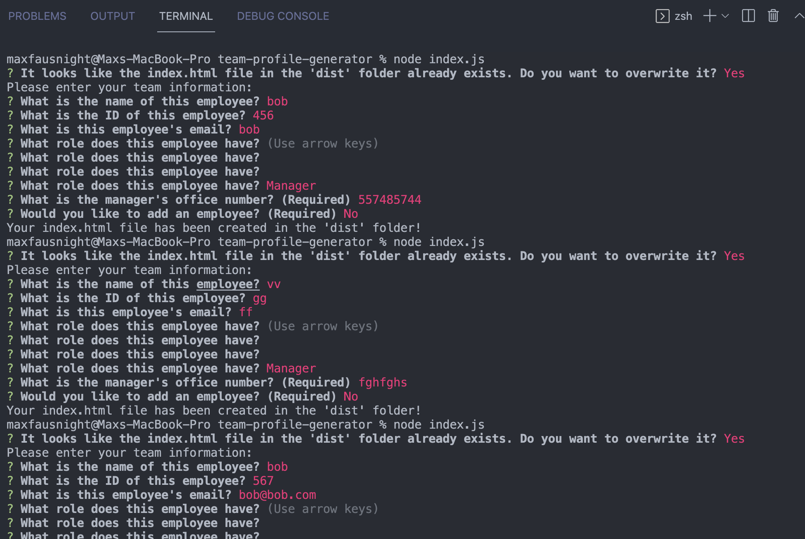
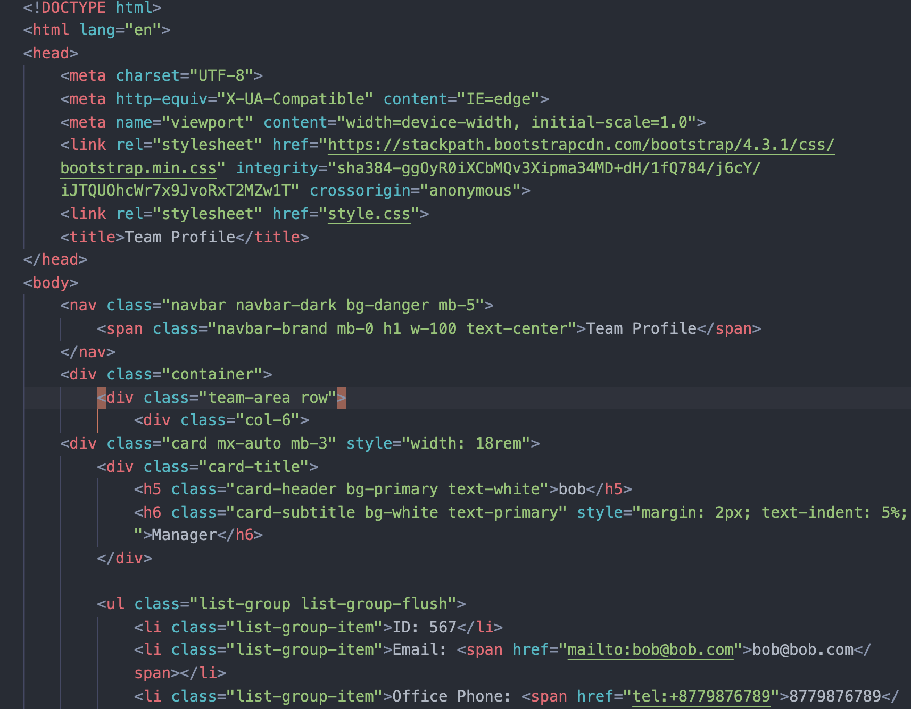

# Team Profile Generator  


## Table of Contents 

- [Description](#description)
- [Usage](#usage)
- [Deployed](#deployedapplicationlink)
- [Languages](#languages)
- [Screenshot](#screenshot)
- [License](#license)
- [Tests](#tests)


## Description

Using Node.js, this application generates a profile of team members for a company. When you follow along with the prompts in the terminal, an html file is generated with a stylized layout.


## Demo

Below is a link to a video demo of the application. 

[](https://youtu.be/ItXS4mn2ufc)


Click the image below for a video demonstration of the tests passing:

[](https://youtu.be/crwdQJ7V-A4)

## Deployed application link

[Live-link](https://fausnightm.github.io/team-profile-generator/)

## Languages

JavaScript, Bootstrap, HTML, Node, Inquirer, Jest

## Screenshot

Here is the command line.

 

This is the index.html file after completion
 

## License

  This project is licensed under the MIT license.
  

## Tests

To run the tests for this application, enter the following command from the root directory:

  ```
  npm run test
  ```
 
